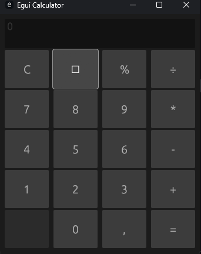

# EguiCalculator



A simple calculator made with Rust and Egui. For testing out the Egui library.

My score for library: 9/10,

It's a great library, but it's not very well documented, and it's hard to find examples of how to use it.

## How to run

```bash
cargo run
```
